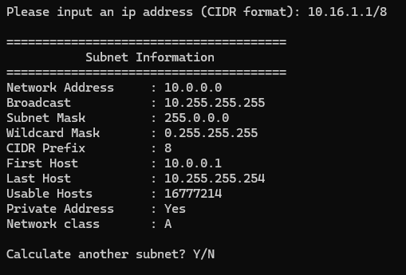

# Subnet Calculator

A simple command-line Subnet Calculator written in Python to strengthen my knowledge of **Python**, **Networking**, and **Cyber Security**.

This project is part of my learning journey and is being developed step by step.

---

## Version 1



---

## Features

- Accepts IPv4 addresses in CIDR notation
- Calculates network address
- Calculates broadcast address
- Displays subnet mask and wildcard mask
- Displays CIDR prefix and network class
- Displays first and last usable host
- Displays maximum usable hosts
- Detects whether the input IP is private
- Interactive "calculate another subnet" loop

### Planned

- Variable Length Subnet Masking (VLSM)
- Input validation with helpful error messages
- IPv6 support
- Binary representation of subnet masks
- Export results as JSON or CSV
- Colorized terminal output
- Unit tests

---

## Technologies

- Python 3
- Standard Library
  - `ipaddress`

No external dependencies are required.

---

## Project Goal

The purpose of this project is **not** simply to build another subnet calculator.
Instead, the goal is to gain a deeper understanding of:

- IPv4 addressing
- CIDR notation
- Network calculations
- Python project structure
- Error handling
- Writing clean, maintainable code

---

## Usage

```bash
python main.py
```

You will be prompted to enter an IP address in CIDR notation.

---

## Example

**Input**

```text
10.16.1.1/8
```

**Output**

```text
========================================
            Subnet Information
========================================
Network Address     : 10.0.0.0
Broadcast           : 10.255.255.255
Subnet Mask         : 255.0.0.0
Wildcard Mask       : 0.255.255.255
CIDR Prefix         : 8
First Host          : 10.0.0.1
Last Host           : 10.255.255.254
Usable Hosts        : 16777214
Private Address     : Yes
Network class       : A
```

---

## Project Structure

```text
subnet-calculator/
│
├── main.py
├── CHANGELOG.md
└── README.md
```

The structure will evolve as the project grows.

---

## Learning Objectives

- Practice Python fundamentals
- Learn to work with the `ipaddress` module
- Improve networking knowledge
- Build software incrementally
- Learn basic software design principles
- Use Git and GitHub for version control

---

## Future Ideas

- Automatic subnet recommendations
- Route summarization
- Supernetting
- Interactive menu
- GUI version
- Web version using Flask or FastAPI

---

## Author

Claudius B. — Apprentice IT Specialist, System Integration

## License

This project is licensed under the MIT License.
